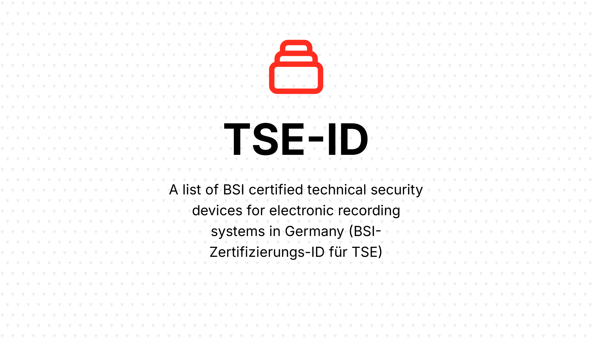

# tse-id

> A list of BSI certified technical security devices for electronic recording systems in Germany (BSI-Zertifizierungs-ID für TSE)

Contains the current list of TSE-IDs in JSON.

The [BSI webpage](https://www.bsi.bund.de/EN/Themen/Unternehmen-und-Organisationen/Standards-und-Zertifizierung/Zertifizierung-und-Anerkennung/Listen/Zertifizierte-Produkte-nach-TR/Technische_Sicherheitseinrichtungen/TSE_node.html?gts=913608_list%253DdateOfRevision_dt%252Bdesc&gtp=913608_list%253D1) is checked automatically every day with the retrieve.yml workflow. Changes

> [!NOTE]  
> The workflow utlizes the [tse-id-php](https://github.com/rechtlogisch/tse-id-php) package.

## Credits

- [Krzysztof Tomasz Zembrowski](https://github.com/zembrowski)
- [All Contributors](../../contributors)

## License

The MIT License (MIT). Please see [License File](LICENSE.md) for more information.
